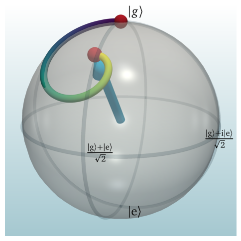

# API Documentation 


::: ifigures.InteractiveFigure  

!!! question "Why use interactive figure?"
    This is discussed in Physics World blogpost and comment. In short, we want to allow exploration of many untold stories and edge cases. To build intuition, connections and maybe get even some inspiration for further work and extensions!

!!! Example "Simple interactive figure"
    ```python
    from ifigures import InteractiveFigure, RangeWidget, RangeWidgetViridis, RadioWidget,DropDownWidget
    import numpy as np
    import matplotlib.pyplot as plt

    def plot(amplitude, omega, time, color, f):
        fig, ax = plt.subplots(figsize=(8, 4))
        x = np.linspace(0, 10, 1000)
        if f=="sin":
            func = np.sin
        else:
            func = np.cos
        ax.plot(x, amplitude * func(omega*x), color=color,
                lw=5, alpha=0.4)
        ax.set_xlim(0, 10)
        ax.set_ylim(-1.1, 1.1)
        ax.set_xlabel(r"Time, $t$")
        ax.set_ylabel(r"$f(t)$")
        ax.set_title("Figure title. f(x) = amplitude * %s(omega*x)"
                    % (f))
        ax.axvspan(time-0.1, time+0.1, color="0.9")
        
        caption = "Figure caption. Amplitude = %.2f, omega = %.2f, color = %s, f(t) = amplitude * %s(omega*x). Highlighted time = %.2f" % (amplitude, omega, color, f, time)
        return (fig, caption)


    figure_example1 = InteractiveFigure(plot,
                amplitude=RangeWidget(0.1, 0.9, 0.4),
                omega=RangeWidget(1.0, 5.01, 2.0),
                time=RangeWidgetViridis(1,9,4),
                color=RadioWidget(['blue', 'green', 'red']),
                f=DropDownWidget(["sin","cos"]))
    figure_example1.saveStandaloneHTML("interactive_figure.html")

    ```
    The above code generates

    <iframe src="../interactive_figure.html" width="100%" height="780"></iframe>


## Input controls for interactive figures

Inputs for interactive figures are range sliders (including specially coloured `RangeWidgetViridis` that we use extensively to mark time evolution in dynamics), drop-down select boxes, and radio buttons, in some combination.

::: ifigures.RangeWidget

!!! Example "Example: a static snapshot of input control widget"
    

::: ifigures.RangeWidgetViridis

!!! Example "Example: a static snapshot of input control widget"
    

::: ifigures.RadioWidget

!!! Example "Example: a static snapshot of input control widget"
    

::: ifigures.DropDownWidget

!!! Example "Example: a static snapshot of input control widget"
    

## Interactive timeline

::: ifigures.InteractiveTimeline

!!! question "Why use timelines?"
    Scientific progress is huge community effort, often undertaken over many decades. Our timelines also have **thickness** since we recognize the importance of cross-breeding of ideas and insights from different "rivers" of thought and experimentation. Timeline format allows readers to explore and understand all the connection in historical development.

!!! example "Timeline for development of electromagnetism"
    [See example here.](./timeline_electromagnetism.html)


## Annotation features for Matplotlib plots
::: ifigures.blobAnnotate
::: ifigures.xAnnotate
::: ifigures.yAnnotate

!!! example "Example of annotations"
    ```python
    import numpy as np
    import matplotlib.pyplot as plt
    from ifigures import *
    from ifigures.my_plots import *  # for color scheme

    fig, ax=plt.subplots(1,1,figsize=(3*1.6, 3))

    some_data = np.linspace(0,8,100)

    ax.plot(some_data, some_data, "-", color=cDUb)
    ax.plot(some_data, np.sqrt(some_data)+1.23, "-", color=cDUr)
    xAnnotate(ax, 0.5, 5.5, color=cDUy)
    blobAnnotate(ax,6,6, 6.5,1,"Nothing! $\Omega_2$", color=cDUggg)
    blobAnnotate(ax,3,3, 4,1,"Something", color=cDUbb, blobSize=100)

    plt.show()
    ```
    produces 

    

!!! tip "Why should one use annotations?"
    Modern figures in reserach papers are often dense with information,
    and **presume substantial previous knowledge** in order to be able to
    focus the sight on few actually
    relevant and interesting points. When working with interactive figures
    we are not bound to one "dead" version of plot on the paper, but can
    show multiple layers of annotations to help final knowledge consumers
    digest important features first, **guiding their focus** in interpretation
    gently.
    More widely, teaching **plot literacy** to wider population is crucial for
    informed decision-making.

::: ifigures.equation

## Additional LaTeX commands

Some special commands are defined by default for use in equation environment

- `\ketbra{A,B}` results in $| A \rangle\langle B |$
- `\braket{A,B}` results in $\langle A | B \rangle$
- **Highlighting:** parts of equation can be higlighted in purple `\hp{...}`, yellow `\hy{...}`, blue `\hb{...}`, gray `\hg{...}`, darker gray `\hgg{...}`, golden `\ho{...}` and red background `\hr{...}`.
- **Frames:** parts of the equation can be framed in purple `fp{...}`, blue `\fb{...}`,
  gray `\fg{...}`, golden `\fg{...}`, and red `fr{...}` frames.

!!! example "Example of equation with additional LaTeX commands"
    ```python
    import matplotlib.pyplot as plt
    from ifigures import *

    fig, ax=plt.subplots(1,1)

    equation(r"""
    $\begin{matrix} \mathcal{H} &=& \hy{\frac{\Omega_1}{2}}~ \ketbra{e}{g}  +\hr{ \Omega_2/2}~ \ketbra{e}{m} \\
    \mathrm{highlight} &:& \hp{\textrm{hp}}~~~\hy{\textrm{hy}} ~~~\hb{\textrm{hb}} ~~~\hg{\textrm{hg}}
    ~~~\hgg{\textrm{hgg}} ~~~\ho{\textrm{ho}}~~~\hr{\textrm{hr}} \\
    \mathrm{frame}& : & \fp{\textrm{fp}}~~~\fb{\textrm{fb}}~~~ \fg{\textrm{fg}}~~~\fo{\textrm{fo}} ~~~\fr{\textrm{fr}}  \end{matrix}$
    """, ax,  fontsize=12, debug=False, x=0.5, y=0.5, dpi=300)

    plt.show()
    ```
    results in

    

## Quantum state visualisations

::: ifigures.getComplexColor

!!! example "Mapping complex numbers to colors"
    {width=300px  align=right}
    Mapping of complex number $A e^{i \phi}$ with amplitude $A$ and phase $\phi$
    to colours used by the library.
    Note that  complementary colours correspond
    to sign difference: green and red (like Italian flag), and yellow and blue.
    In the case the amplitude is zero, all colours are linearly approching white
    for amplitude $A \rightarrow 0$.


::: ifigures.BlochSphere

!!! Example "Bloch sphere example"
    ```python
    import numpy as np
    import matplotlib.pyplot as plt
    from ifigures.amoplots import *

    from scipy.linalg import kron, eig

        
    a = np.linspace(0,8,100)

    f = plt.figure(figsize=(6,8))

    ax1 = plt.subplot(1,1,1)

    def trajectory(gi):
        G=gi*2.0 #input parameter
        Omega=10.0
        Delta=10.0
        phiL=0.1*np.pi/2
        H=np.array([[Delta/2, (Omega/2)*np.exp(-1.j*phiL)],[(Omega/2)*np.exp(1.j*phiL), -Delta/2] ])
        I2=np.eye(2,2)
        Hrho=kron(H,I2)
        rhoH=kron(I2,np.conj(H))
        L=np.array([[0,0,0,G],[0,-G/2,0,0],[0,0,-G/2,0],[0,0,0,-G] ])
        evals, evecs = eig(-1.j*(Hrho-rhoH)+L)
        evecs=np.mat(evecs)
        rho0=np.zeros((4,1))
        rho0[0]=1.0
        npts=50
        tmax=2*np.pi/np.sqrt(Omega**2+Delta**2)
        t=np.linspace(0,tmax,npts)
        u=np.zeros(npts)
        v=np.zeros(npts)
        w=np.zeros(npts)
        for i in range(0,npts):
            rho=evecs*np.mat(np.diag(np.exp(evals*t[i])))*np.linalg.inv(evecs)*rho0
            u[i]=(rho[1]+rho[2]).real
            v[i]=(1.j*(rho[1]-rho[2])).real
            w[i]=(rho[0]-rho[3]).real
        return np.column_stack((u, v, w))
        
    bs = BlochSphere()
    bs.addStateBlob(0,0,1)
    dynamics = trajectory(3)
    bs.addTrajectory(dynamics)
    bs.addStateBlob(0,0,1)
    bs.addStateBlob(*dynamics[-1,:])
    bs.addStateArrow(*dynamics[-1,:],)
    bs.plot(axis=ax1)

    ```
    

    Example above shows Bloch sphere, with annotated key points of the sphere,
    state trajectory in time shown as line with time encoded in viridis gradient,
    state arrow, and two blobs highlighting in this case start and end of the
    evolution. We also notice how trajectory of the system departs the
    surface of the Bloch sphere and dives into inside due to decoherence.
    Note that actual Bloch sphere plot is only last few lines of code, the rest
    is calculation of dynamics.

::: ifigures.DensityMatrix

!!! Example "Densitry matrix visualisation"
    ```python
    import matplotlib.pyplot as plt
    from ifigures.amoplots import *

    fig, ax=plt.subplots(1,1,figsize=(3, 3))

    dm = DensityMatrix()
    dm.plot(ax, [[1/2, 1j/2], [-1j/2, -1/2]])

    plt.show()
    ```
    


::: ifigures.EnergyLevels
